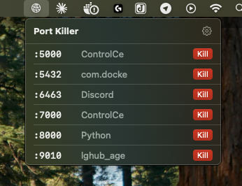
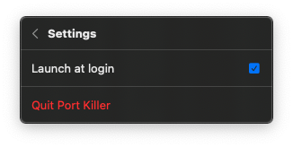

# Port Killer

A macOS menu bar app to view and kill processes running on development ports (3000-9999).


## Features

- **Instant scanning** - Single `lsof` command scans all ports in under 1 second
- **One-click kill** - No confirmation dialogs, just click and it's gone
- **Native UI** - Pure SwiftUI with MenuBarExtra
- **Lightweight** - Lives in your menu bar, hidden from Dock
- **Launch at login** - Optional setting to start automatically

## Screenshots

| Port List | Menu Bar | Settings |
|:---------:|:--------:|:--------:|
|  |  |  |

## Installation

### Download

1. Download `PortKiller-v1.0.0.zip` from [Releases](https://github.com/lexciobotariu/PortKiller/releases)
2. Unzip and drag `PortKiller.app` to Applications
3. On first launch, right-click → **Open** (to bypass Gatekeeper)

### Build from Source

```bash
git clone https://github.com/lexciobotariu/PortKiller.git
cd PortKiller
xcodebuild -scheme PortKiller -configuration Release
```

The built app will be at `build/Build/Products/Release/PortKiller.app`

## Requirements

- macOS 14.0 (Sonoma) or later

## How It Works

Port Killer uses `lsof -iTCP -sTCP:LISTEN -P -n` to find all listening TCP ports, filters to the 3000-9999 range (common development ports), and displays them in a clean list. Killing a process sends `SIGKILL` to terminate it immediately.

## License

MIT
